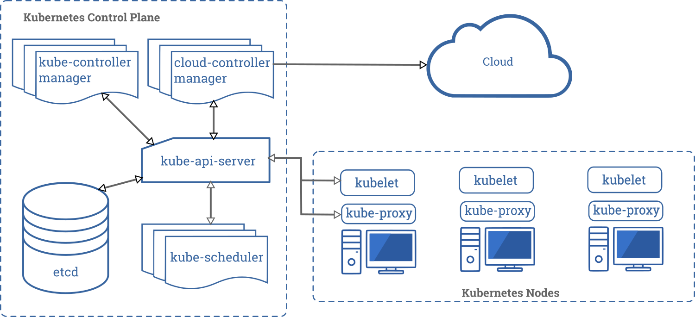

# Kubernetes 组件

一个 Kubernetes 集群 \(`cluster`\)包含多个节点\(`node`\)。

### 节点（Node）

两种类型：

* 主节点：承载着k8s控制和管理整个集群系统的控制面板\(`control panel`\)
* 工作节点：运行用户实际部署的应用

这些节点运行容器化的应用。 

每一个集群至少有一个工作节点\(`worker node`\)。

### Pods

Pods 托管在工作节点上。Pods 属于应用程序工作负载\(`application workload`\)的组件。控制面板\(`control panel`\)管理着集群中的工作节点和pods。



## 控制面板组件（Control Plane Components）

控制面板的组件对集群做出全局决策\(比如调度\)，以及检测和响应集群事件。可以运行在单个**主节点**或者通过副本部署在多个**主节点**上。

### kube-apiserver：

属于k8s控制面板的一个组件。主要暴露了k8s的API。它是k8s控制面板的前端。

kube-apiserver 被设计成水平扩展，可以靠部署更多的实例来进行扩展。所以可以运行kube-apiserver 的多个实例并且均衡它们之间的流量。

### kube-scheduler:

该组件监视那些新创建并且没有给他们安排节点的 Pod。该组件可以选择一个可以让 Pod 在上面运行的节点。

### kube-controller-manager

该组件运行控制器。执行集群级别的功能，如复制组件，持续跟踪工作节点和处理节点失败。

控制器包括：

* 节点控制器（Node Controller）: 负责在节点出现故障时进行通知和响应。
* 副本控制器（Replication Controller）: 负责为系统中的每个副本控制器对象维护正确数量的 Pod。
* 端点控制器（Endpoints Controller）: 填充端点\(Endpoints\)对象\(即加入 Service 与 Pod\)。
* 服务帐户和令牌控制器（Service Account & Token Controllers）: 为新的命名空间创建默认帐户和 API 访问令牌.

### etcd:

可靠的分布式数据存储。持久化存储集群配置。

### cloud-controller-manager

[cloud-controller-manager](https://kubernetes.io/docs/tasks/administer-cluster/running-cloud-controller/) 运行与基础云提供商交互的控制器。

cloud-controller-manager 仅运行云提供商特定的控制器循环。

以下控制器具有云提供商依赖性:

* 节点控制器（Node Controller）: 用于检查云提供商以确定节点是否在云中停止响应后被删除
* 路由控制器（Route Controller）: 用于在底层云基础架构中设置路由
* 服务控制器（Service Controller）: 用于创建、更新和删除云提供商负载均衡器

## 节点组件\(Node components\)

节点组件运行在每一个节点上。用于管理pods,为k8s提供运行环境。

### kubelet：

一个在集群中每个节点上运行的代理。它保证容器都运行在 Pod 中。kubelet 接收一组通过各类机制提供给它的 PodSpecs，确保这些 PodSpecs 中描述的容器处于运行状态且健康

查看 Kubelet 服务状态：

```text
sudo systemctl status kubelet
```

### kube-proxy:

负责组件之间的均衡负载网络流量。

[kube-proxy](https://kubernetes.io/docs/reference/command-line-tools-reference/kube-proxy/) 是集群中每个节点上运行的网络代理,实现 Kubernetes [Service](https://kubernetes.io/docs/concepts/services-networking/service/) 概念的一部分。kube-proxy 维护节点上的`IP tables` 网络规则。这些网络规则允许从集群内部或外部的网络会话与 Pod 进行网络通信。

### Container runtime:

容器运行环境是负责运行容器的软件。


